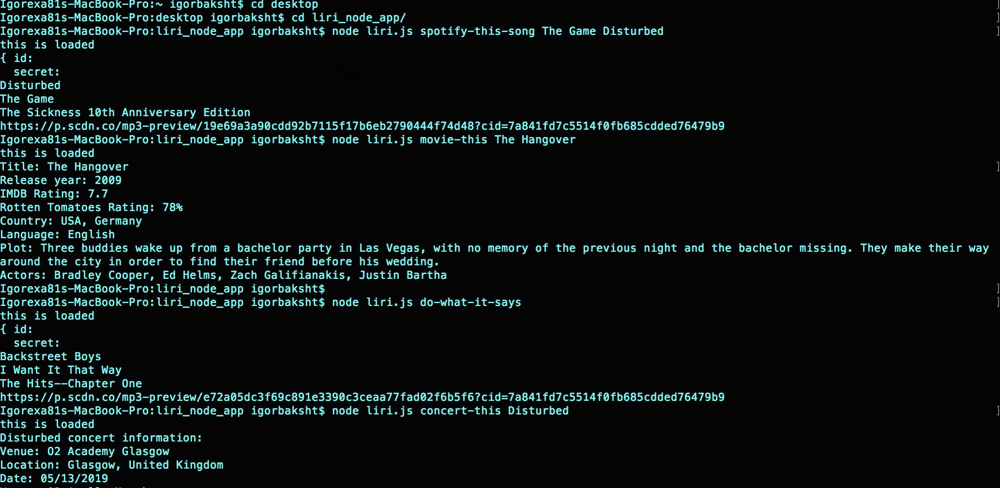

# LIRI BOT

# Assignment

LIRI is like iPhone's SIRI. However, while SIRI is a Speech Interpretation and Recognition Interface, LIRI is a Language Interpretation and Recognition Interface. LIRI will be a command line node app that takes in parameters and gives you back data.

# Technologies

JavaScript, Node.js Npm request library, Spotify API.

# Instruction of how to use LIRI

spotify-this-song: This search will use Spotify API for song and inforamtion about the song, Album and
date release.

movie-this: This search will use OMDB API for the movie name, inforamtion of the movie, cast, year it came out, and rating of the movie.

do-what-it-says: LIRI will take the text in the file called random.txt, and use it to call the LIRI command.

concert-this: This search will use Events API, to give information, the date of concert, the venue location and name of the venue.